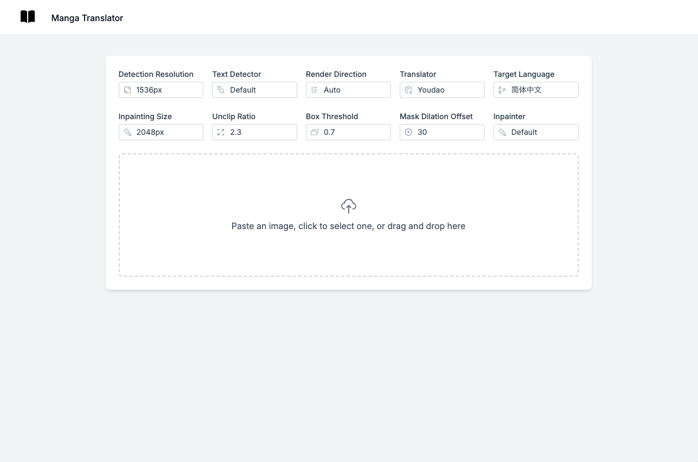

[中文说明](README_CN.md)

## Features

- 🖼️ Multi-image upload support (drag & drop, paste, file picker)
- 🔄 Real-time translation status updates
- 🚀 Server-side rendering
- ⚡️ Hot Module Replacement (HMR)
- 🎉 TailwindCSS for styling
- 🔒 TypeScript by default

## Tech Stack

- **Framework**: Nuxt 3 (Vue 3)
- **Runtime/Package manager**: Bun
- **Styling**: TailwindCSS
- **Language**: TypeScript
- **API Communication**: Fetch API with streaming support

## Getting Started

### Installation

Install the dependencies:

```bash
bun install
```

### Development

Prepare Fast API server at `http://127.0.0.1:8000/`
According to this repository:

https://github.com/zyddnys/manga-image-translator

Start the development server with HMR:

```bash
bun run dev
```

Your application will be available at `http://localhost:3000`.

## Building for Production

Create a production build:

```bash
bun run build
```

Preview the production build:

```bash
bun run preview
```

## Image




## Backend Code

https://github.com/zyddnys/manga-image-translator
